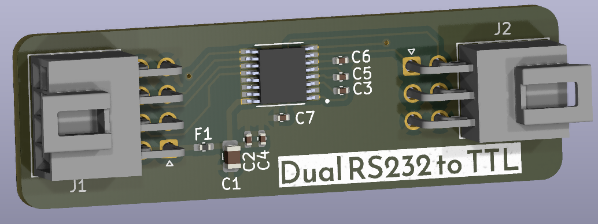

# Dual RS232 to TTL converter
> Simple dual channel RS232 to TTL converter using the MAX3232.

## Table of Contents
* [General Info](#general-information)
* [Features](#features)
* [Screenshots](#screenshots)
* [Setup](#setup)
* [Usage](#usage)
* [Project Status](#project-status)
* [Room for Improvement](#room-for-improvement)
* [Acknowledgements](#acknowledgements)
* [Contact](#contact)
* [License](#license)

## General Information
- This is a simple breakout board for a MAX3232 that allow you to convert old devices with RS232 into a microcontroller UART
<!-- You don't have to answer all the questions - just the ones relevant to your project. -->

## Features
- Is a simple converter, what else do you want!?

## Screenshots

<!-- If you have screenshots you'd like to share, include them here. -->

## Setup
None

## Usage
How does one go about using it?
Provide various use cases and code examples here.

`write-your-code-here`

## Project Status
Project is:  _complete_ 

## Room for Improvement
Maybe develop an alternative PCB with dual DB9 connectors?

## Acknowledgements
- none

## Contact
Created by [@herranz]- feel free to contact me!

 ## License 
 This project is open source and available under the [CERN-OHL-W](https://ohwr.org/cern_ohl_w_v2.txt).

